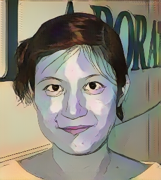
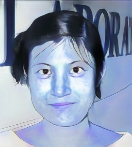
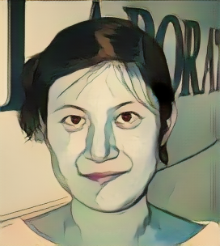
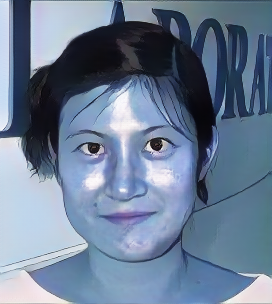
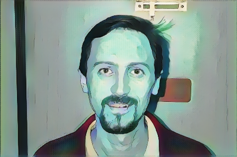
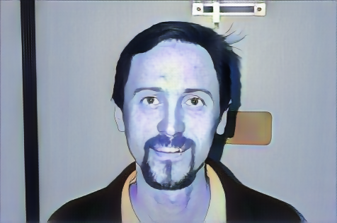
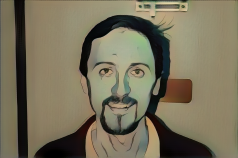
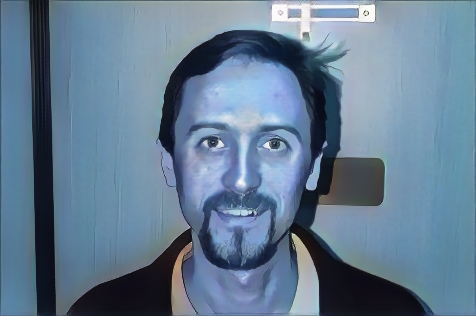

# Img2Cartoon (CartoonGAN)

Pytorch and Torch testing code of [CartoonGAN](http://openaccess.thecvf.com/content_cvpr_2018/CameraReady/2205.pdf) `[Chen et al., CVPR18]`. With the released pre train model file in  **[URL](http://cg.cs.tsinghua.edu.cn/people/~Yongjin/Yongjin.htm)** by Yongjin, thanks.

## Getting started

### Operational requirements

- Linux or Windows
- NVIDIA GPU
- [Python](https://www.python.org/downloads/release/python-374/) >= 3.7
- [PyTorch](https://pytorch.org/) >= 1.0
- [Torchvision](https://pytorch.org/) >= 0.3.0
- [Numpy](https://www.numpy.org/) >= 1.14.0
- [Pillow](https://python-pillow.org/) >= 0.5.0
- CUDA >= 10.0

### Quick installer

```text
git clone https://github.com/dayHRResearch/Img2Cartoon
cd Img2Cartoon
```

#### Linux

- CPU

```text
pip3 install https://download.pytorch.org/whl/cpu/torch-1.1.0-cp37-cp37m-linux_x86_64.whl
pip3 install https://download.pytorch.org/whl/cpu/torchvision-0.3.0-cp37-cp37m-linux_x86_64.whl
pip3 install -r requirements.txt
```

- GPU

```text
pip3 install https://download.pytorch.org/whl/cu100/torch-1.1.0-cp37-cp37m-linux_x86_64.whl
pip3 install https://download.pytorch.org/whl/cu100/torchvision-0.3.0-cp37-cp37m-linux_x86_64.whl
pip3 install -r requirements.txt
```

#### Windows

- CPU

```text
pip3 install https://download.pytorch.org/whl/cpu/torch-1.1.0-cp37-cp37m-win_amd64.whl
pip3 install https://download.pytorch.org/whl/cpu/torchvision-0.3.0-cp37-cp37m-win_amd64.whl
pip3 install -r requirements.txt
```

- GPU

```text
pip3 install https://download.pytorch.org/whl/cu100/torch-1.1.0-cp37-cp37m-win_amd64.whl
pip3 install https://download.pytorch.org/whl/cu100/torchvision-0.3.0-cp37-cp37m-win_amd64.whl
pip3 install -r requirements.txt
```

## Download pre trained model file

You can load the trained model `pth` file directly.

- Download the converted models:

```text
sh model/download.sh
```

- For running:

```text
python source/run.py --input_dir YourImgDir --output_dir OutImgDir

```

- For testing:

```text
python source/test.py
```

## Examples (Left: original, Right: output)

<p>
    
    
</p>

<p>
    
    
</p>

<p>
    
    
</p>

<p>
    
    
</p>

<p>
    
    
</p>

<p>
    
    
</p>

<p>
    
    
</p>

<p>
    
    
</p>

## Note

- The training code should be similar to the popular GAN-based image-translation frameworks.

## Acknowledgement

- Code borrows from
- [DCGAN](https://github.com/soumith/dcgan.torch)
- [CycleGAN](https://github.com/junyanz/pytorch-CycleGAN-and-pix2pix).
